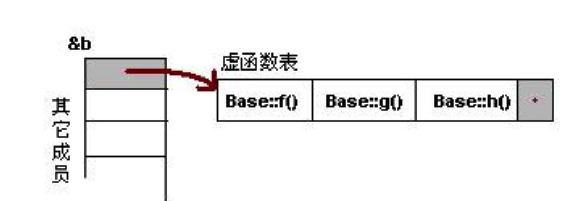
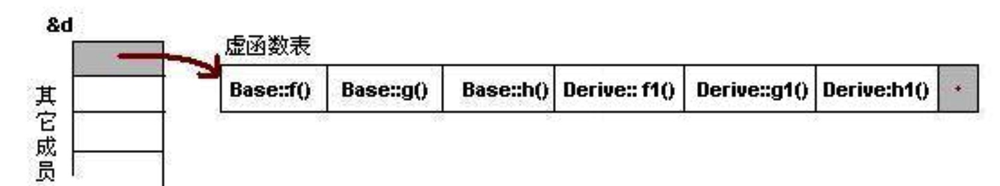
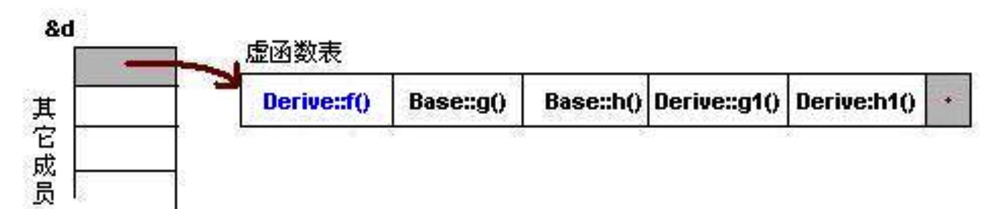
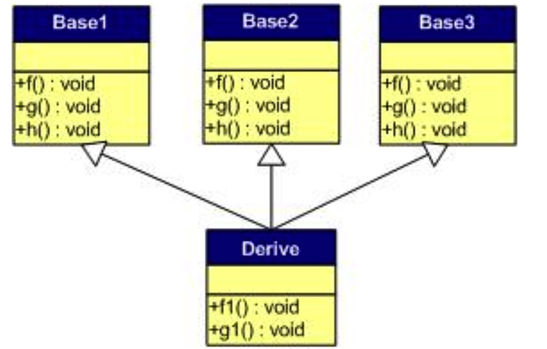
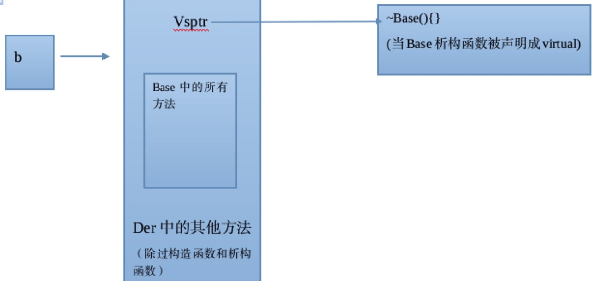

### Arena Allocation
更省内存，更高效
用于 Protobuf 中时，可以在 .proto 使用
option cc_enable_arenas = true;


### TFGraphModel relations

TFGraphModel public based on BaseGraphModel.

BaseGraphModel public based on AutoUpdateDict.


### AutoUpdateDict 全览

```c++
class AutoUpdateDict : noncopyable {
 public:
  AutoUpdateDict(): dict_update_time_(0), model_file_modified_time_(0),
    update_interval_sec_(kNoUpdate), // kNoUpdate is static -1
    timer_thread_(nullptr), 
  	// 以后细看 bthread::TimerThread::INVALID_TASK_ID
  	task_id_(bthread::TimerThread::INVALID_TASK_ID),
    is_running_(false)  // 初始设为不运行
    {}

  /*
    虚析构函数为了避免内存泄漏，并且是当子类中会有指针成员变量时才会使用到
    虚析构函数使得在删除指向子类对象的基类指针时可以调用子类的析构函数达到释放子类中堆内存的目的，而防止内存泄露的
 	*/
  virtual ~AutoUpdateDict() {
  }

  
  virtual void Init(const std::string& dict_file_path,
                    int32_t update_interval_in_sec = kNoUpdate,
                    bthread::TimerThread* timer_thread = nullptr);

  /**
   * Init dict from Json::Value
   * val contain keys:
   *   required "id": string
   *   required "path": string
   *   optional "update_interval": int
   * if "update_interval" not set, it will use -1 to Init this object.
   * @param val                    [description]
   * @param update_interval_in_sec [description]
   * @param io_service             [description]
   */
  virtual bool InitFromJson(const rapidjson::Value& val, bthread::TimerThread* timer_thread = nullptr);

  virtual std::unordered_map<std::string, AutoUpdateDict*> GetDicts();

  virtual void Run();

  virtual void Stop();

  virtual bool IsRunning() const {
    return is_running_;
  }

  virtual std::string ToString() const = 0;

  virtual bool Load(const std::string& file_path) = 0;
  
  // 如果新模型跟已经加载的模型兼容(网络结构等) 返回true，
  // 如果不兼容返回false
  virtual bool IsCompatible(const std::string& file_path);
  
  bool UpdateOnce();

  static const int kNoUpdate = -1;

  virtual void RecordMonitorMsg() const;

  void SetDictID(const std::string &s) {
    dict_id_ = s;
  }

  std::string GetDictID() {
    return dict_id_;
  }

  std::string GetDictPath() {
    return dict_file_path_;
  }

  // bool NeedToLoad(std::string *model_md5, time_t *model_modeify_time);
  bool VerifyDict(std::string *model_md5, time_t *model_modeify_time);
  bool DictUpdated();

  /**
   * static factory function.
   * use val["class_name"] to create Object.
   * It will init Object and set dict_id after create Object
   */
  static AutoUpdateDict* CreateObjectWithInit(const rapidjson::Value &val, bthread::TimerThread* timer_thread = nullptr);

  static void Routine(void *arg);
  static std::atomic_bool enable_dict_update; 
  static std::atomic_int slave_model_ratio;

 private:
  void HandleUpdate();
  void ScheduleNextUpdate();
  void UpdateMonitorMsg();
  
  std::string status_file_path_;
  time_t dict_update_time_;
  time_t model_file_modified_time_;
  int32_t update_interval_sec_;
  

 protected:

  bool CheckMd5ForFile(const std::string &file, const std::string &status_file, std::string *md5);

  bool CheckMd5ForDir(const std::string &path, const std::string &status_file, std::string *md5);

  /**
   * Extract file_name, record md5 and saved into file_name, model_md5
   * Format of line is:
   *   $md5 $file_name
   * @param  line        [Line will be extract]
   * @param  file_name   [description]
   * @param  model_md5   [description]
   * @return             [description]
   */
  bool ParseLine(std::string& line,
                 std::string* file_name,
                 std::string* model_md5,
                 bool need_path);

  /**
   * Read <file_name, dict_id_md5> into map.
   * Return true if read success.
   *
   * The format of line in file_path is:
   *   $dict_id_md5 $path/file_name
   * @param  file_path [The file will be read.]
   * @param  map       [Output map. key-value is : <file_name, dict_id_md5>]
   * @return           [description]
   */
  bool ParseGroupFile(const std::string& file_path,
                      std::unordered_map<std::string, std::string>* map,
                      bool need_path);

  // timer thread 
  bthread::TimerThread* timer_thread_; // not owned
  bthread::TimerThread::TaskId task_id_;
  std::string dict_file_path_;
// Deprecated  boost::asio::io_service* io_service_;
  bool is_running_;

  std::string md5_;
  std::string dict_id_;
};
```


### AutoUpdateDict

AutoUpdateDict is noncopyable.


#### noncopyable

新建类在构造函数中分配内存时，在析构函数中释放内存：


```c++
template<typename _T>
class Matrix {
public:
   int w;
   int h;
   _T* data;
   
   // 构造函数
   Matrix(int _w, int _h): w(_w), h(_h){
      data = new  _T[w*h];
   }

   // 析构函数
   ~Matrix() {
       delete [] data;
   }
}
```


如果没有重载拷贝函数，拷贝这个类：


```c++
/// 测试1：等号拷贝
void copy(){
    Matrix<double> m1(3,3);
    Matrix<double> m2(3,3);
    m1 = m2; 
}

/// 测试2：传参和返回中的构造拷贝
template<typename _T>
Matrix<_T> copy(Matrix<_T> cpy) {
    Matrix<_T> ret(3,3); 
    return ret;
} 
```


上面的测试 1 中，我们先构造了 `m1` 和 `m2` 两个 `Matrix` 实例，这意味着他们各自开辟了一块动态内存来存储矩阵数据。然后我们使用 `=` 将 `m2` 拷贝给 `m1`，这时候 `m1` 的每个成员（`w`，`h`，`data`）都被各自使用 `=` 运算符拷贝为和 `m2` 相同的值。`m1.data` 是个指针，所以就和 `m2.data` 指向了同一块的内存。于是这里就会出现两个问题：其一， 发生拷贝前 `m1.data` 指向的动态内存区在拷贝后不再拥有指向它的有效指针，无法被释放，于是发生了内存泄露；其二，在 `copy()` 结束后，`m1` 和 `m2` 被销毁，各自调用析构函数，由于他们的 `data` 指向同一块内存，于是发生了双重释放。


测试 2 中也有类似问题。当调用 `copy(Matrix<_T> cpy)` 时，形参 `cpy` 拷贝自实参，而 `cpy` 会在函数结束时销毁，`cpy.data` 指向的内存被释放，所以实参的矩阵数据也被销毁了——这显然是我们不愿意看见的。同样的，在返回时，`ret` 随着函数结束而销毁，返回值因为拷贝自 `ret`，所以其矩阵数据也被销毁了。


因此，对于像 `Matrix` 这样的类，我们不希望这种拷贝发生。一个解决办法是重载拷贝函数，每次拷贝就开辟新的动态内存：


```c++
Matrix<_T>& operator = (const Matrix<_T>& cpy) {
    w = cpy.w;
    h = cpy.h;
    delete []  data;
    data = new _T[w*h];
    memcpy(data, cpy.data, sizeof(_T)*w*h);
    return *this;
}

Matrix(const Matrix<_T>& cpy):w(cpy.w), h(cpy.h) {
    data = new _T[w*h];
    memcpy(data, cpy.data, sizeof(_T)*w*h);
}
```


这样做也有不好的地方。频繁开辟动态内存，当数据量很大时（比如图像处理），对程序性能是有影响的。在接口设计的角度考虑，应该把这种拷贝操作以较明显的形式提供给用户，比如禁用等号拷贝，以直接的函数代替 `=` 操作：


 ```c++
void copyFrom(const Matrix<_T>& cpy) {
    w = cpy.w;
    h = cpy.h;
    delete []  data;
    data = new _T[w*h];
    memcpy(data, cpy.data, sizeof(_T)*w*h);
}
 ```


那么，如何禁止拷贝操作呢？


##### 实现不可拷贝类，使用 boost::noncopyable

Boost 作为 C++ 万金油工具箱，在 `<boost/noncopyable.hpp>` 下提供了不可拷贝类的实现，使用起来也非常简单，让自己的类继承自 `boost::noncopyable` 即可：


```c++
class Matrix : boost::noncopyable
{
    // 类实现
}
```


如果不想用第三方库，自己实现呢？不妨先看一下 Boost 是怎么做的：


```c++
private:  // emphasize the following members are private
    noncopyable( const noncopyable& );
    noncopyable& operator=( const noncopyable& );
```


直接把拷贝函数声明为私有的就等于禁用了:


```c++
template<typename _T>
class Matrix 
{
private:
    Matrix(const Matrix<_T>&);
    Matrix<_T>& operator = (const Matrix<_T>&);
}
```


C++ 11 中 利用 delete 关键字即可实现不可拷贝类

 

```c++
template<typename _T>
class Matrix 
{
public:
    Matrix(const Matrix<_T>&) = delete;
    Matrix<_T>& operator = (const Matrix<_T>&) = delete;
}
```


### 多态

C++ 中的 **虚函数的作用主要是实现了多态的机制**

多态，就是 **用父类型别的指针指向其子类的实例**，然后通过父类的指针调用实际子类的成员函数（当然引用也可以达到该目的，引用也是指针的另一种变种）

这种技 术可以让父类的指针有“多种形态”，这是一种泛型技术。**泛型技术**就是试图 **用不变的代码来实现可变的算法**。

比如：模板技术，RTTI技术，虚函数技术，要么是试图做到在编译时决议，要么试图做到运行时决议。 

**虚函数表**

**虚函数（Virtual Function）是通过一张虚函数表（Virtual Table）来实现的。简称为V-Table。**

在这个表中，主要是一个类的虚函数的地址表，这张表解决了继承、覆盖的问题，保证其容真实反应实际的函数。

在有虚函数的类的实例中这个表被分配在了 这个实例的内存中

当我们用父类的指针来操作一个子类的时候，这张虚函数表指明了实际所应该调用的函数


编译器必需要保证虚函数表的指针存在于对象实例中最前面的位置（这是为了保证正确取到虚函数的偏移量）

意味着我们通过对象实例的地址得到这张虚函数表，然后就可以遍历其中函数指针，并调用相应的函数

```c++
class Base
{
public:
    virtual void f (){cout<<"Base::f()"<<endl;}
    virtual void g() {cout<<"Base::g()"<<endl;}
    virtual void h() {cout<<"Base::h()"<<endl;}
}; 

// 可以通过Base的实例来得到虚函数表。 下面是实际例程：

typedef void(*Fun)(void); 
Base b; 
Fun pFun = NULL; 
cout << "虚函数表地址：" << (int*)(&b) <<endl;
cout << "虚函数表 — 第一个函数地址：" << (int*)*(int*)(&b) <<endl;
pFun = (Fun)*((int*)*(int*)(&b)); 
pFun(); 
```




在虚函数表的最后多加了一个结点，这是虚函数表的结束结点，就像字符串的结束符“\0”一样，其标志了虚函数表的 结束

在Ubuntu 7.10 + Linux 2.6.22 + GCC 4.1.3下，这个值是如果1，表示还有下一个虚函数表，如果值是0，表示是最后一个虚函数表


**分别说明“无覆盖”和“有覆盖”时的虚函数表的样子。**没有覆盖父类的虚函数是毫无意义的

**a.一般继承（无虚函数覆盖）**


在这个继承关系中，子类没有重载(重写)任何父类的函数。那么，在派生类的实例中，其虚函数表如下所示：
对于实例：Derive d; 的虚函数表如下：




1）虚函数按照其声明顺序放于表中。
2）父类的虚函数在子类的虚函数前面。


**b.一般继承（有虚函数覆盖）**
覆盖父类的虚函数是很显然的事情，不然，虚函数就变得毫无意义


只覆盖了父类的一个函数：f()

那么，对于派生类的实例，其虚函数表:




1）覆盖的f()函数被放到了虚表中原来父类虚函数的位置。
2）没有被覆盖的函数依旧存在。

```c++
Base *b = new Derive(); 
b->f(); 
```

由b所指的内存中的虚函数表的f()的位置已经被Derive::f()函数地址所取代，

于是在实际调用发生时，是Derive::f()被调用了。这就实现了多态


**2.多重继承（无虚函数覆盖）**
下面，再让我们来看看多重继承中的情况，假设有下面这样一个类的继承关系。注意：子类并没有覆盖父类的函数。





对于子类实例中的虚函数表:


1） 每个父类都有自己的虚表。
2） 子类的成员函数被放到了第一个父类的表中。（所谓的第一个父类是按照声明顺序来判断的）
这样做就是为了解决不同的父类类型的指针指向同一个子类实例，而能够调用到实际的函数。


**3.多重继承（有虚函数覆盖）**
下面我们再来看看，如果发生虚函数覆盖的情况。
下图中，我们在子类中覆盖了父类的f()函数。


对于子类实例中的虚函数表的图：


三个父类虚函数表中的f()的位置被替换成了子类的函数指针。

可以任一静态类型的父类来指向子类，并调用子类的f()了

```c++
Derive d; 
Base1 *b1 = &d; 
Base2 *b2 = &d; 
Base3 *b3 = &d; 
b1->f(); //Derive::f() 
b2->f(); //Derive::f() 
b3->f(); //Derive::f() 
b1->g(); //Base1::g() 
b2->g(); //Base2::g() 
b3->g(); //Base3::g() 
```


继承和多态需要掌握的知识点：
继承过程中的访问属性
继承过程中的父类、对象成员、子类的构造以及析构顺序
继承过程中的函数同名隐藏
多继承中容易产生二义性，可以用::进行解决，如果是从同一个基类进行继承，那么要考虑是否是有虚拟继承，即虚基类
类型兼容原则的类容
多态的实现必然以父类的指针或引用作为基础，如果以父类的对象进行调动，会出现子对象的切片现象
掌握多态的实现原理（虚指针、虚表），以及各种继承情况下的虚表图
8、纯虚函数以及抽象基类


### 虚析构函数

```c++
virtual ~AutoUpdateDict() {}
```

  虚析构函数为了避免内存泄漏，并且是当子类中会有指针成员变量时才会使用到

虚析构函数使得在删除指向子类对象的基类指针时可以调用子类的析构函数达到释放子类中堆内存的目的，而防止内存泄露的

##### 下面的程序很重要，牢记

```c++
#include <iostream>
using namespace std;
 
class ClxBase
{
    public:
        ClxBase() {};
        virtual ~ClxBase() { cout<<"D1: delete ClxBase"<<endl; };
 
        virtual void DoSomething() { cout << "S1: Do something in class ClxBase!" << endl;  };
 
};
 
class ClxDerived : public ClxBase
{
    public:
        ClxDerived() {};
        ~ClxDerived() { cout << "D2: Output from the destructor of class ClxDerived!" << endl;  };
 
        void DoSomething() { cout << "S2: Do something in class ClxDerived!" << endl;  };
 
};
 
int main(int argc, char const* argv[])
{
  	 // 基类指针指向派生类对象
     ClxBase *pTest = new ClxDerived;
  	 // 基类指针所指函数仍然执行派生类函数
     pTest->DoSomething();
  	 // 析构基类指针时，若有virtual函数，先调用派生类析构，再调用基类析构
  	 // 如果没有virtual函数，则析构基类指针只调用基类机构，造成内存泄漏
     delete pTest;
     return 0;
}

/* 
output is 
S2: Do something in class ClxDerived!
D2: Output from the destructor of class ClxDerived!
D1: delete ClxBase

如果去掉 virtual，output is:
S2: Do something in class ClxDerived!
D1: delete ClxBase

*/
```

一般情况下类的析构函数里面都是释放内存资源，而析构函数不被调用的话就会造成内存泄漏。

使用 virtual 是为了当用一个基类的指针删除一个派生类的对象时，派生类的析构函数会被调用。 


并不是要把所有类的析构函数都写成虚函数。

当类里面有虚函数的时候，编译器会给类添加一个虚函数表，里面来存放虚函数指针，这样就会增加类的存储空间。

所以，只有当一个类被用来作为基类的时候，才把析构函数写成虚函数。


**虚析构函数的原理分析**

先调用父类的构造函数，再调用子类的构造函数

这里有一个问题:父类的构造函数/析构函数与子类的构造函数/析构函数会形成多态，但是当父类的构造函数/析构函数即使被声明virtual，子类的构造/析构方法仍无法覆盖父类的构造方法和析构方法。这是由于父类的构造函数和析构函数是子类无法继承的，也就是说每一个类都有自己独有的构造函数和析构函数。


而由于父类的析构函数为虚函数，所以子类会在所有属性的前面形成虚表，而虚表内部存储的就是父类的虚函数

即使子类也有虚函数，但是由于是单继承，所以也只有一张虚表，来自多态。

执行 Base *b = new Der;之后b的最终形态：



当delete父类的指针时，由于子类的析构函数与父类的析构函数构成多态，所以得先调动子类的析构函数；之所以再调动父类的析构函数，是因为delete的机制所引起的,delete 父类指针所指的空间，要调用父类的析构函数

所以结果如下：

```c++
create Base;
create Der;
delete Der;
delete Base;
```


### hash_map: unordered_map

C++ STL中，哈希表对应的容器是 `unordered_map`（since C++ 11）。

根据 C++ 11 标准的推荐，用 `unordered_map` 代替 `hash_map`


哈希表是根据关键码值(key value)而直接进行访问的数据结构。也就是说，它通过把关键码值映射到表中一个位置来访问记录，以加快查找的速度，这个映射函数叫做散列函数。

哈希表的一个重要问题就是如何解决映射冲突的问题。常用的有两种：**开放地址法** 和 **链地址法**


STL中，`map` 对应的数据结构是 **红黑树**。红黑树是一种近似于平衡的二叉查找树，里面的数据是有序的。在红黑树上做查找操作的时间复杂度为 **O(logN)**。而 `unordered_map` 对应 **哈希表**，哈希表的特点就是查找效率高，时间复杂度为常数级别 **O(1)**， 而额外空间复杂度则要高出许多。所以对于需要高效率查询的情况，使用 `unordered_map` 容器。而如果对内存大小比较敏感或者数据存储要求有序的话，则可以用 `map` 容器


unordered_map 基本使用

```c++
#include <iostream>
#include <unordered_map>
#include <string>
int main(int argc, char **argv) {
    std::unordered_map<int, std::string> map;
    map.insert(std::make_pair(1, "Scala"));
    map.insert(std::make_pair(2, "Haskell"));
    map.insert(std::make_pair(3, "C++"));
    map.insert(std::make_pair(6, "Java"));
    map.insert(std::make_pair(14, "Erlang"));
    std::unordered_map<int, std::string>::iterator it;
    if ((it = map.find(6)) != map.end()) {
        std::cout << it->second << std::endl;
    }
    return 0;
}
```


**自定义类用于 unordered map 中**

STL 只为 C++ 常用类提供了散列函数，因此如果想在 `unordered_map` 中使用自定义的类，则必须为此类提供一个哈希函数和一个判断对象是否相等的函数（e.g. 重载 `==` 运算符）


```c++

class Person {
public:
    std::string phone;
    std::string name;
    std::string address;
    explicit Person() {}
    explicit Person(std::string name, std::string phone, std::string address): name(name), phone(phone), address(address) {}
    // overload operator==
    bool operator==(const Person& p) {
        return this->phone == p.phone && this->name == p.name
            && this->address == p.address;
    }
    inline friend std::ostream& operator<<(std::ostream& os, Person& p) {
        os << "[Person] -> (" << p.name << ", " << p.phone << ", "
           << p.address << ")";
        return os;
    }
};


// declare hash<Person>
template <> struct hash<Person> {
  std::size_t operator()(const Person& p) const {
    
    // Compute individual hash values for first,
    // second and third and combine them using XOR
    // and bit shifting:
    return ((std::hash<std::string>()(p.phone)
             ^ (std::hash<std::string>()(p.name) << 1)) >> 1)
      ^ (std::hash<std::string>()(p.address) << 1);
  }
};

std::unordered_map<string, Person> phoneMap;

void selectByPhone() {
    std::string phone;
    std::cout << "Input the phone number: ";
  	std::cin >> phone;
    std::unordered_map<std::string, Person>::iterator it;
    int size = phoneMap.size();
    for(int pc = 0; pc < size; pc++) {
        if((it = phoneMap.find(phone)) != phoneMap.end()) {
            std::cout << "Query result: " << it->second << std::endl;
            return;
        }
    }
    std::cout << "Query result : target_not_found" << std::endl;
}

```


**explicit**

C++提供关键字`explicit`，可以阻止不应该允许的经过转换构造函数进行的隐式转换发生

将拷贝构造函数声明为explicit，则会阻止隐式拷贝构造函数的调用

`explicit`关键字只对有一个参数的类构造函数有效, 如果类构造函数参数大于或等于两个时, 是不会产生隐式转换的, 所以`explicit`关键字也就无效了

但是将拷贝构造函数声明成`explicit`并不是良好的设计，一般只将有单个参数的`constructor`声明为`explicit`，而`copy constructor`不要声明为`explicit`.


