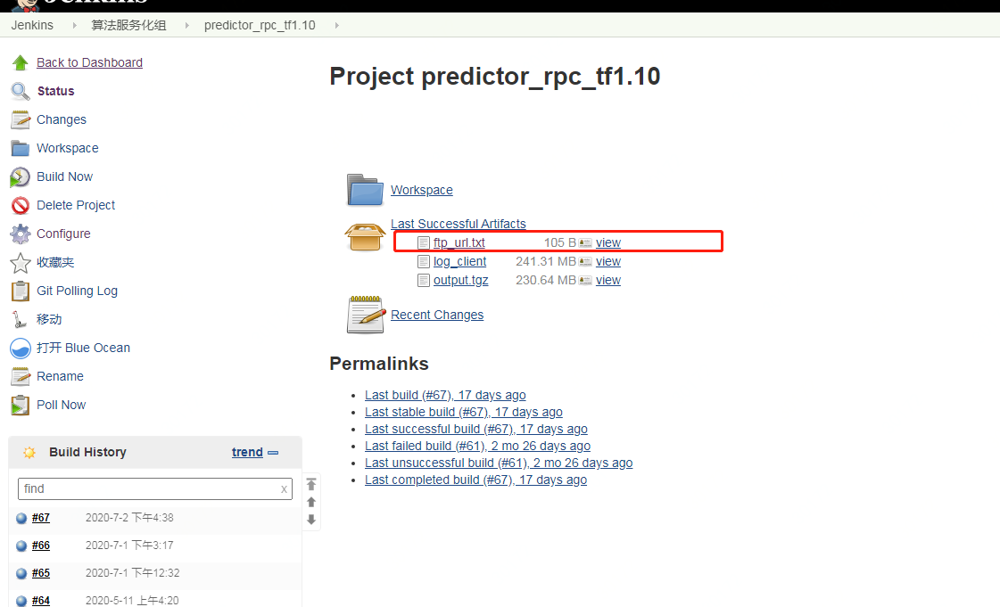

### 1. 第一周 2020/06/29 - 2020/07/05

brpc

protobuf

bazel


照着这个文档，先把predictor编译过吧

https://cf.jd.com/pages/viewpage.action?pageId=192576377


健哥 scp 源

 [lijian@10.181.47.140](mailto:lijian@10.181.47.140):/export/lijian/tools/bazel-0.18.0-installer-linux-x86_64.sh

密码： lijian


predictor git：https://[git.jd.com/ads-model/predictor_rpc](http://git.jd.com/ads-model/predictor_rpc)


https://cf.jd.com/pages/viewpage.action?pageId=102547691


predictor的一些设计文档： https://cf.jd.com/pages/viewpage.action?pageId=102547691

predictor的一些对外文档： https://cf.jd.com/pages/viewpage.action?pageId=102332538


这个predictor 的 core

https://git.jd.com/tf-model/predictor_lib_rpc

predictor_rpc 是在外面套了一层core


BRPC 已经可以Client / Server运行了

可以看看bthread那个文档

brpc的文档写的还是挺详细的

看看bthread的概念，实现原理之类的


git submodule init

git submodule update


or


git clone —recursive


### 2. 第二周 2020/07/06 - 2020/07/12


带你简单过下predictor代码

https://git.jd.com/ads-model/predictor_online_conf

这个git可以结合https://cf.jd.com/pages/viewpage.action?pageId=102332538  这个文档看看


测试粗排

搭建predictor_search_presort_pb完成后，运行export

配置设置


http://xqp.jd.com/#task  搭建predictor测试环境  任务列表--创建新任务

从模块创建，模块predictor

配置中，输入：predictor_search_presort_pb


/export/App/predictor_search_presort_pb

script/start_service.sh


ps -ef |grep _server

客户端 跑一下

tensor Flow


pino_instance_pb.proto  v1 版本

https://git.jd.com/ads-model/predictor_client  客户端

https://git.jd.com/ads-model/rpc_feature_server/blob/master/src/feature_extraction/common/feature_list.h  特征namespace


predictor_request.proto V2


AutoUpdateDict  模型自动更新的基类 ，  重点看 TFGraphModel

DataUpdater  多个模型的管理类

Inference：  对应的处理流程是处理  V2 版本request；看TfInference

Scorer： 对应的处理流程处理 V1版本 request；UnifyTFScorer


c++ 实现反射


对应关系：

-scorer_class_name=TfInference


predictor_rpc/server/[main.cc](http://main.cc/)

predictor_lib_rpc/server/inference_server.h  :  V2 版本

predictor_lib_rpc/server/predictor_server.h ： V1版本


gdb

bazel build ... -c dbg


V2  https://git.jd.com/ads-model/predictor_client/blob/master/pino_predictor_client/send_predictor_request.py


### 3. 第三周 2020/07/13 - 2020/07/19


申请权限：

http://xbp.jd.com/4/apply/1308


已授权：

ads-model / predictor_rpc

​					/ third_party

​					/ brpc

​					/ predictor_interface

​					/ toft

​					/ ducc_api

​					/ ucc_api

​					/ Bulbs

​					/ jimdb_sdk

​					/ ads_common

​					/ predictor_client

​					/ rpc_feature_server

tf-model / predictr_lib_rpc


benchmark

g++ log.cc -std=c++11 -isystem benchmark/include-Lbenchmark/build/src -lbenchmark -lpthread -o logbench


bazel test certain 

bazel test -j 8 @predictor_lib_local//framework:framework_test


gg 跳至文件首行

dG 清空整个文件


PosTransDict： predictor_lib_rpc/framework/pos_trans_dict.h

调用点：V1版本：predictr_lib_rpc/framework/[scorer.cc](http://scorer.cc/)  PostDoScore

V2 版本： predictor_lib_rpc [predictor_inference.cc](http://predictor_inference.cc/)  PostProcess


predictor_search_presort_pb 上次给你看的这个平台 正好有t变换的配置


这个是 bazel编译的时候内存不够

后续修改后编译时：

cd server

bazel build … -j 8

这里要注意是否看，**output/bin 是否修改 **


bazel test -j 8 @predictor_lib_local//framework:framework_test


nohup ./bin/predictor_server --flagfile=./script/predictor_server.gflags &


这么生成的 md5sum file_name > file_name.status


取 predictor_server 可执行文件

scp tongweiwei3@10.172.88.217:/export/tongweiwei3/predictor_rpc/output/bin/predictor_server /export/App/predictor_search_presort_pb/bin/


存历史记录

scp -r /export/App/predictor_search_presort_pb tongweiwei3@10.172.88.217:/export/tongweiwei3/history/2020_07_20


python 安装包:

[lijian@10.174.119.173](mailto:lijian@10.174.119.173):/export/lijian/tools/Anaconda2-4.3.0-Linux-x86_64.sh

installed in /home/admin/anaconda2


protobuf :

[lijian@10.174.119.173](mailto:lijian@10.174.119.173):/export/lijian/tools/protobuf-3.6.1-cp37-cp37m-manylinux1_x86_64.whl

 

[lijian@10.174.119.173](mailto:lijian@10.174.119.173):/export/lijian/tools/protobuf-3.3.0-cp27-cp27mu-manylinux1_x86_64.whl


```c++
trans
default = 1.5
629=1.3
633=1.5
782=1.2
1292=1.1
1223=1.1

weight 
default=1.0
629=1.5
633=1.3
782=1.4
1292=1.05
1223=1.1


629 trans = 1.3
629 weight = 1.5
初始值 = 0.0318150781095

只设置 use_trans = true
计算值 = 初始值 ^ 1.3
计算值 = 0.0113089620854
实际值 = 0.0113089658328

只设置 use_weight = true
计算值 = 初始值 * 1.5
计算值 = 0.04772261716425
实际值 = 0.0477226171643

设置 use_trans = true 并且 设置 use_weight = true
计算值 = 1.5 * (初始值 ^ 1.3)
计算值 = 0.0169634431281
实际值 = 0.0169634487491

设置 use_trans = true 并且 设置 use_weight = true 并且 设置 reverseSigmoid = true
res = 0.0169634431281
计算值 = ln(res / (1 - res) )
计算值 = -4.05958568415442
实际值 = -4.05958534707


633 trans = 1.5
633 weight = 1.3
初始值 = 0.0312235876918

只设置 use_trans = true
计算值 = 初始值 ^ 1.5
计算值 = 0.00551726958724
实际值 = 0.00551726958724

只设置 use_weight = true
计算值 = 初始值 * 1.3
计算值 = 0.04059066399934
实际值 = 0.0405906639993

设置 use_trans = true 并且 设置 use_weight = true
计算值 = 1.3 * (初始值 ^ 1.5)
计算值 = 0.00717245046342
实际值 = 0.00717245046341

设置 use_trans = true 并且 设置 use_weight = true 并且 设置 reverseSigmoid = true
res = 0.00717245046342
计算值 = ln(res / (1 - res) )
计算值 = -4.93030962044675
实际值 = -4.93030962045
```


### 4. 第四周 2020/07/20 - 2020/07/26


查看 build.sh ，不用每次都通过 build.sh 来构建bin

以后自己构建


strings 命令可以查找 bin 文件 来找到对应的标志或语句

strings predictor_server | grep use_pos_weight


后处理文档

https://cf.jd.com/pages/viewpage.action?pageId=112436219 

Code 合了之后就能配合业务方小流量了

文档可以补下，到时候给业务方看


[http://model-jks.jd.com/view/%E7%AE%97%E6%B3%95%E6%9C%8D%E5%8A%A1%E5%8C%96%E7%BB%84/](http://model-jks.jd.com/view/算法服务化组/)

这个是咱们要用于上线的bin文件的地址


这个文件就对应 git 目录里面 bin.des 里面的那个路径: ftp://mfs.jd.com:/mnt/mfs/jks/model/jobs/predictor_rpc_tf1.10/builds/68/archive/predictor_rpc/output.tgz

然后需要把这个地址放到bin.des里面

对，如果需要上线的话，需要




但是这个是业务方的需求

predictor的这种业务方需求一般都是由业务方上线

然后咱们给他们支持下，告诉 他们怎么配就行了


这个需求做完之后 有一个predictor的架构升级到时候你来开发完，可以走一遍小流量--全量的流程

架构升级的东西一般由咱们上线


bin 用这个 [ftp://mfs.jd.com:/mnt/mfs/jks/model/jobs/predictor_rpc_tf1.10_tensorflow/builds/54/archive/predictor_rpc/output.tgz](ftp://mfs.jd.com:/mnt/mfs/jks/model/jobs/predictor_rpc_tf1.10_tensorflow/builds/54/archive/predictor_rpc/output.tgz)


#### 4.1 新工作

注意 Com + P 搜索并进入文件

inference_server.cc

inference->ProcessFeatureLog

inference->ProcessFeatureLog  入口

ExecutionQueue  执行队列

LogManager::LogHandler  第一层执行队列

LogHandler::TaskHandler  第二层执行队列

LogProcessorPbMap  V2 版本

对照着下面这个文档看

https://cf.jd.com/pages/viewpage.action?pageId=75294616

ArchiveLogInfo.proto


需要看的内容：

bthread::TimerThread* timer_thread_;

bthread::TimerThread::TaskId task_id_;

brpc::Controller

rapidjson::Document

rapidjson::Value


